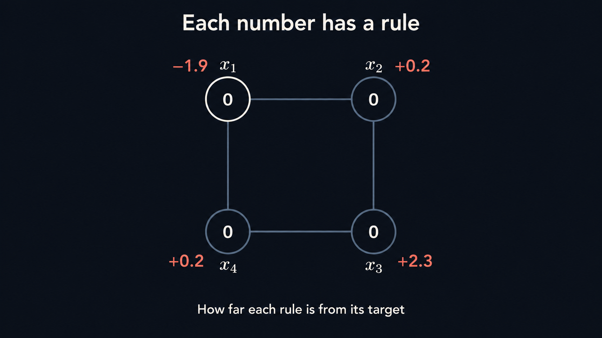
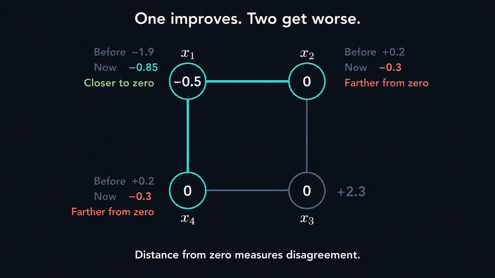
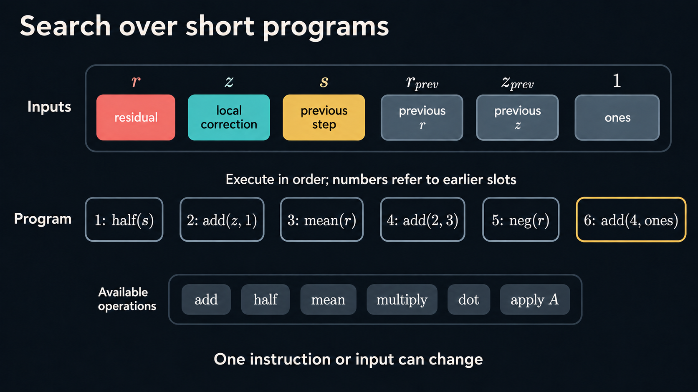
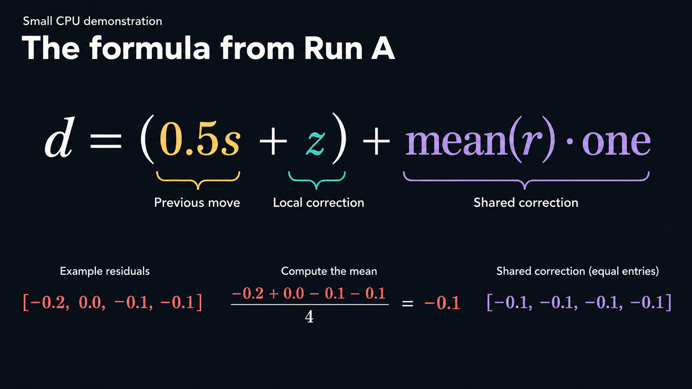
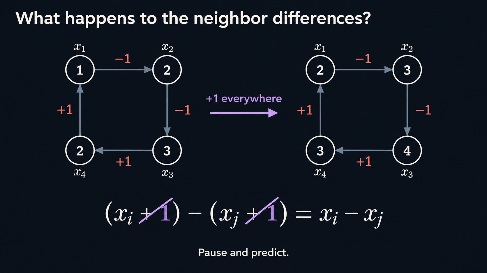
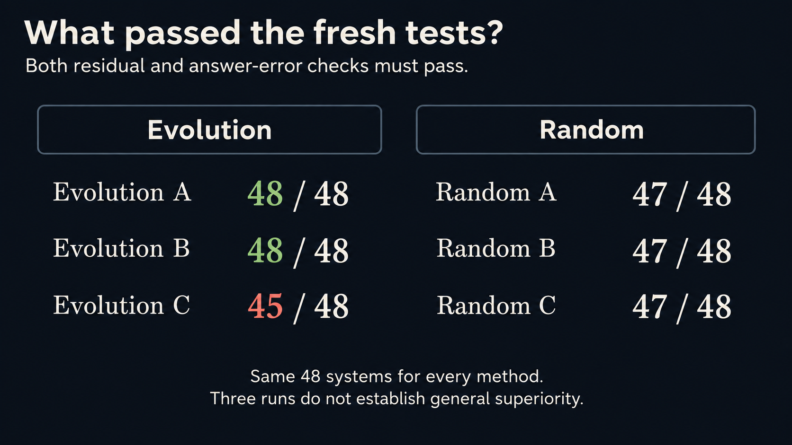
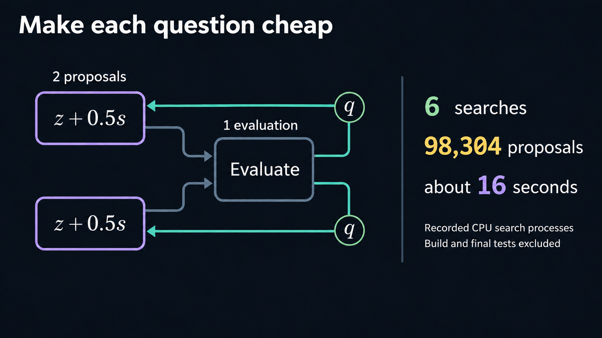
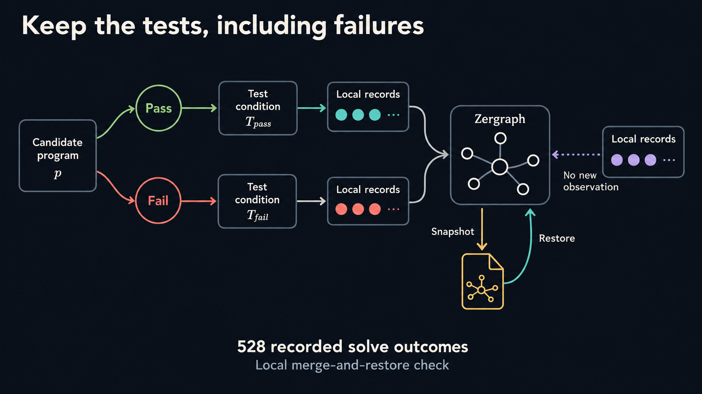

# Can a computer discover a way to solve equations?

Suppose I give you a grid of numbers, and a rule that each number has to satisfy.
You can change any of the numbers. But changing one also affects the rules at
its neighbors. So a move that fixes one part of the grid can disturb another.
Your task is to get all the rules to agree.



This repository lets a computer search for a procedure for doing that. It starts
with random short programs, tests them, and changes the better ones. You can run
the demonstration on a CPU in under a minute on the machine used for our recorded
run, excluding compiler setup. Your timing will depend on your machine.

The search constructed useful formulas that we can inspect and explain. Two of
three evolutionary runs solved all 48 held-out test systems. Established solvers
also solved all 48 and used less work under our operation-counting rule.

Follow the guide below, or [run the demonstration](#run-it).

## 1. Why changing one number is difficult

A point has a rule that relates its value to its neighbors. Problems with this
structure appear in models of heat flow and forces between connected parts.

Here is a small example. Change the upper-left number from zero to −0.5. Its
rule gets closer to its target, but the two neighboring rules get farther away.
The numbers outside the circles show the remaining disagreement.



These are simultaneous linear equations. Each rule adds fixed multiples of the
unknown numbers. In a larger grid, each equation still involves only a few
neighbors. That makes the system *sparse*.

The four-number example has solution `[1, 2, 3, 2]`. It is a teaching example,
separate from the measured test suite. The challenge is to construct a procedure
that works on many systems without being given their answers.

## 2. Give the search arithmetic, then test its combinations

A wrong guess supplies a useful signal. Put it into each equation and subtract
the result from the target. This list of discrepancies is the *residual*.
A local correction divides each discrepancy by that equation's own-number
coefficient. The search can use both lists and recent history.



Every program has six instruction slots. An instruction can read the inputs or
a result from a preceding instruction. It can add, subtract, multiply, divide,
negate, halve, copy, take a minimum or maximum, or calculate an average. It can
also calculate a **dot product** or **apply A** to a list of numbers.

A dot product multiplies corresponding entries in two lists and adds the
products. For example, the dot product of `[1, 2]` and `[3, 4]` is
`1*3 + 2*4 = 11`. Applying `A` means evaluating all the equations' left sides
on a given list. Applied to a proposed change, it tells us how that change would
affect every equation. These operations give the program information about
both individual numbers and the system as a whole.

The final instruction produces a direction: a list that says how much each
number should change relative to the others. A supplied rule then chooses how
far to move in that direction. Together, the direction and step length turn
the current guess into the next one.

We test each program on eight practice systems, also called training systems.
Eight keeps this CPU example quick to run while providing several examples
from two weight families, with four systems per family. It is a demonstration
budget, not a number shown to be sufficient or optimal. A larger study should use many more practice systems
and a wider range of sizes and structures, with separate systems reserved for
testing. Increasing the practice set also increases the cost of each proposal.

Each test rewards a smaller residual and charges for computational work.
Evolution keeps some programs and changes one instruction or input at a time.
Fresh random programs keep entering the search. A separate random-search
control lets us compare the two approaches.

Here, *unseeded* means that no complete solver programs are supplied as starting
recipes. The arithmetic language, practice problems, score and step-size rule
define what the search can construct and how it chooses programs. This demonstration
uses evolutionary search, with no neural training or language-model proposals.

## 3. Read the rule that appeared

One run constructed this direction:

```text
d = (0.5*s + z) + mean(r)*one
```

Here `d` is the proposed direction, `s` is the previous step, `z` is the local
correction, and `r` is the residual. The list `one` contains a one at every
point. Thus `mean(r)*one` adds the same average residual to every point.
The formula combines half of the previous step with the local correction,
then adds this shared correction.



A second run constructed `(z + s) + mean(r)*one`. Neither run received either
formula as a starting program. Both formulas combine recent movement with a
local change and a change shared across the whole grid.

We can now write the update precisely. The current guess is `x`, the targets
are `b`, and the matrix `A` contains the equation coefficients. Therefore
`r = b - A*x`. The diagonal matrix `D` contains each equation's own-number
coefficient, so `z = D^-1*r` is the local correction described above.

The step length is called `alpha`. The supplied rule chooses it to minimize
the system's quadratic energy along `d`:

```text
alpha = dot(r, d) / dot(d, A*d)
x = x + alpha*d
```

If the denominator is at most `1e-30`, the solver sets `alpha` to zero instead
of dividing. This avoids division by zero or a very small positive value.
The program chooses `d` within this supplied update rule.

## 4. Why might an average help?

Add one to every number. What happens to the difference between two neighbors?



The extra ones cancel. Neighbor differences cannot detect a uniform offset.
In our teaching example, only a small additional term notices it. Each answer
can be wrong by one while its equation disagrees by only one tenth.

Larger errors can contain both local variation and a shared offset. On periodic
grids with a constant shift, averaging the residual isolates the uniform part.
The discovered formula gives that shared correction extra weight.

This explains a useful feature of the formula. It does not show that its
coefficients are optimal or that it works for every sparse system. A pure
uniform error can also disappear in one suitable exact line-search step; the
interesting behavior involves mixed errors.

## 5. Try the formulas on different systems

Freeze the chosen programs, then change the grid size, shifts and boundaries.
Check both the equation residual and the error against a reference answer that
the solver never sees.



### Measured results

We run evolution and random search with seeds 11, 22 and 33. Each of these six
searches receives 16,384 proposals and selects one program using the practice
systems. We save all six choices before testing any of them on 48 separate
systems. This keeps the test answers out of program selection.

| Method | Accurate test systems | Mean charged work |
|---|---:|---:|
| Evolution, seed 11 | 48 / 48 | 157.21 |
| Evolution, seed 22 | 48 / 48 | 206.42 |
| Evolution, seed 33 | 45 / 48 | 198.08 |
| Random search, each of seeds 11, 22 and 33 | 47 / 48 | 191.89 |
| Fixed illustrative formula | 48 / 48 | 163.75 |
| Diagonal-preconditioned descent | 12 / 48 | 452.66 |
| Diagonal PCG | 48 / 48 | 154.88 |
| PCG with a constant-space correction | 48 / 48 | 135.51 |

Charged work counts operations with fixed weights. It is not elapsed time.
An accurate result must pass both residual and solution-error checks. The table
includes failures in each mean work value. PCG means preconditioned conjugate
gradient. The fixed illustrative formula is supplied only for comparison; it
is not one of the search winners. See [all results](results/README.md) and the [full report](results/report.json).

Evolution and random search each solved 141 of 144 test cases across their
three winners. These cases reuse the same 48 matrices, so that total is not
144 independent test problems. This small experiment does not establish an
overall evolutionary-search advantage. Its clearest result is the construction
of inspectable, useful formulas from random starts.

## 6. Search speed changes what we can test

The six CPU searches made 98,304 proposals in about 16 seconds of recorded search
process time, excluding compilation and final tests. Identical active programs
share an evaluation, while their proposals remain separately counted.



The evaluator also skips instructions that do not contribute to the final
output. These choices let the search spend its time on distinct active
computations. The recorded run executes 368,976 practice solves after reusing
scores within each search. Each distinct program evaluation uses eight solves.
The report keeps proposal counts, executed solves and elapsed time separate.

## 7. Keep a record of each result

A candidate can pass one condition and fail another. The optional Zergraph
example stores the candidate, test condition and outcome as separate connected
records. It uses the actual completed tests from this demonstration.



Its local check splits, merges and restores all 528 recorded solve outcomes.
Repeated delivery adds no duplicate observation. This demonstrates evidence
retention; it does not establish a distributed scheduler or a solver improvement.
See [the runnable Zergraph example](examples/zergraph).

## Run it

Requirements: a C++17 compiler, Make and Python 3.9 or later. The demonstration
uses one CPU thread and the Python standard library. It needs no GPU or model.

```sh
make test
python3 run.py --out runs/demo
python3 tests/verify_run.py runs/demo
```

The six search arms took about 16 seconds in the recorded macOS ARM64 run.
Compiler setup is separate and recorded. Other machines will differ.
The output directory must be new. It contains the frozen winners, per-system
solutions, metrics, program text, source hashes and a compact report.

The implementation compiles once. A rollout interprets six integer triples.
Generated programs cannot call the host, allocate memory or compile code.

## Settings for the demonstration

The systems represent weighted connections on a grid, with a positive term at
each point. Their matrices are symmetric and positive definite. We choose a
reference answer, calculate the equation targets from it, and keep that answer
hidden from the solver. This lets us check both the residual and the actual
solution error.

| Setting | Value |
|---|---|
| Program size | Six instructions |
| Practice set | Eight periodic grid systems, each with 64 unknowns |
| Search budget | 16,384 proposals per method and seed |
| Retained parents | 32 programs, ranked by mean practice score |
| New evolutionary proposals | One-quarter fresh random programs; otherwise a one-field mutation |
| Practice iteration limit | 48 steps per solve |
| Test set | 48 systems with 64 or 256 unknowns, using new problem seeds |
| Test variations | Two weight families, varying positive shifts, periodic and fixed-zero boundaries |
| Test iteration limit | 128 steps per solve |
| Arithmetic | Float64 on one CPU thread |

The practice score is `min(5, -log10(residual)) - 0.001*work`. The residual has
a floor of `1e-5` when calculating this score, and an invalid solve receives
`-5`. A test result counts as accurate only when its relative residual is at
most `1e-5` and its relative solution error is at most `1e-3`. Because the
practice score trades residual reduction against work, the accuracy check is
reported separately.

All comparison methods use the same test systems. They never enter the search
as starting programs. The fixed illustrative formula is
`z + ((z + s) + mean(r)*one)`. The constant-space PCG comparison uses
`D^-1*r + one*sum(r)/sum(A*one)` as its preconditioning step.

These settings keep the example short and reproducible. Equal proposal counts
do not imply equal elapsed time or equal numbers of distinct evaluations.
The test suite is public; use fresh test systems when developing new variants.

## Find your way around the code

- [src/search.cpp](src/search.cpp) contains the program language, sparse systems,
  evaluator, mutation search, random control and numerical controls.
- [run.py](run.py) freezes selections and runs the separate test suite.
- [tests/test_numerics.py](tests/test_numerics.py) checks returned vectors against
  independent dense recurrences, recomputes errors and checks reproducibility.
- [examples/zergraph](examples/zergraph) records actual results in a mergeable
  evidence graph. It checks reversed merge order, repeated delivery and restore.
  This optional example requires Rust and network access to build dependencies.

## What to learn from this example

The demonstration connects a search over short programs to a mathematical
explanation of the formulas it constructs. You can use it to teach program
search, compare scoring rules, or examine how a formula behaves when the
underlying equations change.

The results describe this small family of grid systems. Three search seeds
and 48 public test systems are enough to make the example inspectable, but do
not establish general solver reliability or mathematical novelty. Established
solvers provide useful reference points for interpreting the constructed rules.

For numerical background, see
[Templates for the Solution of Linear Systems](https://www.netlib.org/templates/templates.html).
[PETSc's deflation documentation](https://petsc.org/release/manualpages/PC/PCDEFLATION/)
introduces corrections through a small vector space, which relate to the
constant-space comparison used here.

Code is available under the MIT license.
